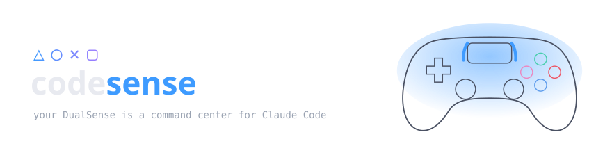
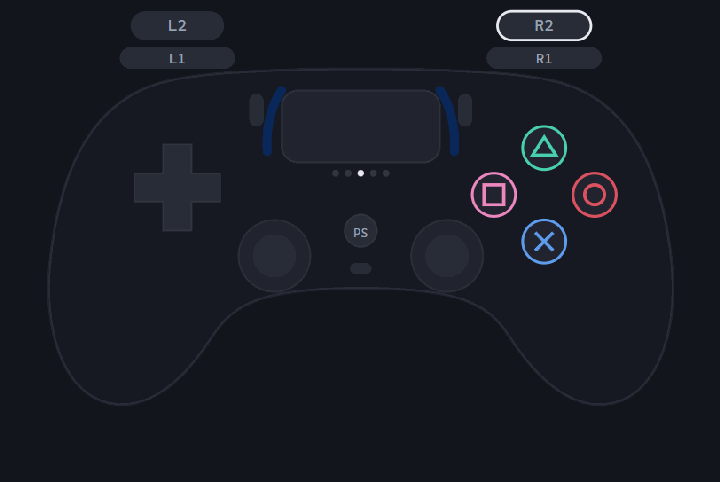
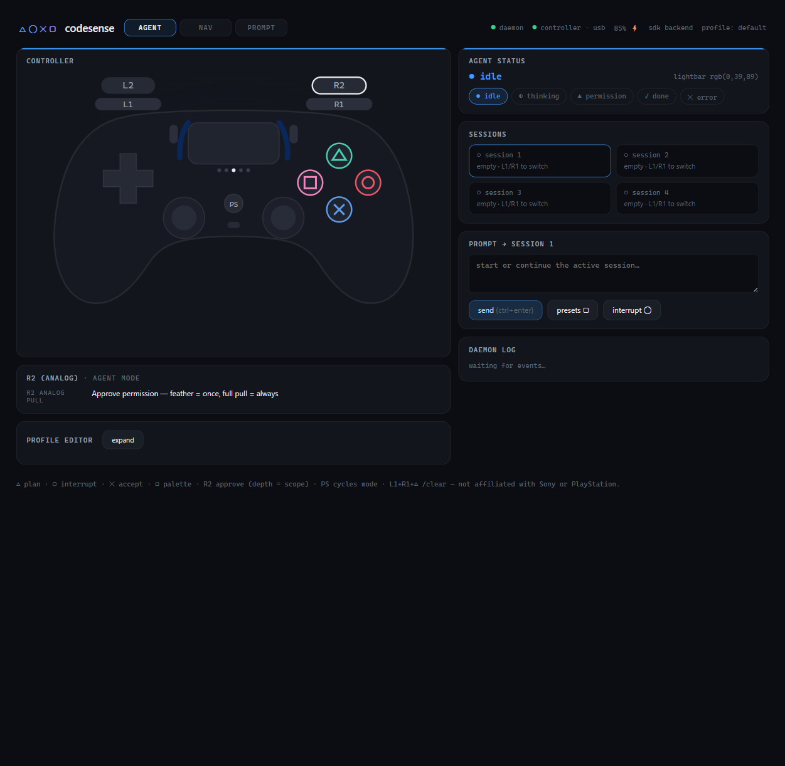

<p align="center">
  <picture>
    <source media="(prefers-color-scheme: dark)" srcset="assets/banner-dark.svg">
    <source media="(prefers-color-scheme: light)" srcset="assets/banner-light.svg">
    
  </picture>
</p>

<p align="center">
  
  
  
  
</p>

**CodeSense** turns a stock PS5 DualSense controller into a tactile controller *and* live status display for [Claude Code](https://claude.com/claude-code). Buttons drive the agent; the agent drives the lightbar, player LEDs, haptics, and adaptive triggers back — so you *feel* the moment your agent needs you and approve it with a squeeze, without breaking flow.

<p align="center">
  
  <br><em>the lightbar is the agent: blue idle → purple thinking → amber "needs you" → green done</em>
</p>

> OpenAI shipped a **$230 macro pad** (Codex Micro) whose best-liked trick is a row of RGB keys showing agent status. A **$70 DualSense you already own** has more of everything — RGB lightbar, 5 player LEDs, two sticks, analog triggers with *programmable resistance*, a touchpad, haptics — and CodeSense uses all of it. Open source, cross-platform, terminal-native, and it does force-feedback approval a macro pad physically can't.

## △ the signature interaction

When Claude asks for permission to run a tool, the lightbar pulses **amber**, the pad double-taps your palms, and **R2 becomes a weighted trigger**:

- **feather the pull** and release → *approve once*
- **pull all the way through the resistance** → *always allow this tool*
- **▢** → show what you're approving (the actual command, plus Ctrl+E explanation)
- **◯** → reject

Approval stops being a reflexive `y` keystroke and becomes a deliberate physical act — with scope selected by pull depth. The dashboard shows the exact command being approved, and **destructive-looking commands** (`rm -rf`, force-push, `reset --hard`…) announce themselves with a sharper double-buzz so risky approvals *feel* different.

## ◯ what the lightbar tells you

| state | lightbar | haptics |
|---|---|---|
| idle | calm blue, low glow | — |
| thinking / tool running | purple, 2.4 s breathing | — |
| **waiting for you** | amber, double-pulse | double-tap |
| done | green fades, then back to idle | soft pulse |
| error | red flash ×2, then solid | sharp buzz |

Glance at the pad from across the room and know whether your agent needs you. Tap **R3** any time to replay the current status as a haptic + LED burst.

Beyond the lightbar: **player LEDs count live subagents** (more lights = more agents working under Claude), a **haptic tap** fires when a background task or subagent finishes, mode changes flash the LEDs so you know where you are, and the **reasoning dial flashes brightness by effort level** — dim for `/effort low`, blinding for `max`.

## 🎙 talk to your agent

Hold **L2** and speak — CodeSense streams key-repeat into Claude Code's native `/voice` dictation, so the trigger is a true push-to-talk. Release to drop the transcript into the input, then edit it without touching the keyboard: **◯ backspace · ◯-hold delete word · △-hold clear line · L1/R1 word jumps · L1+R1+▢ undo**. Toggle dictation with the **mute button** (where else?).

## ✕ quickstart

```powershell
# install from npm (the `codesense` command lands on your PATH):
npm install -g @binliu14/code-sense

# ...or from source:
#   pnpm install && pnpm build
#   pnpm --filter @binliu14/code-sense bundle && npm install -g ./packages/cli

# wire Claude Code hooks (they feed agent state to the controller)
codesense hooks install

# check your setup — controller plugged in over USB
codesense doctor
codesense test        # lightbar/LED/rumble/trigger hardware check

# go — from ANY project directory
cd c:\path\to\your\project
codesense start
```

On Linux, install the udev rule first — see [docs/platforms.md](docs/platforms.md). macOS and Linux support is implemented but lightly tested — reports welcome.

`codesense start` wraps `claude` in a pseudo-terminal: **your normal Claude Code session, unchanged**, except your controller now works — and the pad shows agent state. The web dashboard is served at [`http://localhost:3737`](http://localhost:3737).

No controller handy? `codesense start --mock` gives you a virtual pad in the dashboard.

### multi-session command center

```powershell
codesense start --backend sdk
```

The SDK backend owns up to **4 Claude sessions** mapped to the player LEDs. **L1/R1** switch the active session, the lightbar tracks the session you're on, and any session that needs permission rumbles the pad — even if it's not the active one. Prompts, live transcripts, and **per-session cost** live in the dashboard.

## ▢ default mapping (AGENT mode)

| control | action |
|---|---|
| ✕ cross | accept / approve default |
| ◯ tap | escape / interrupt |
| **◯ hold** | **rewind — open the checkpoint menu** (Esc Esc), restore with d-pad + ✕ |
| △ triangle | cycle permission mode (plan / accept-edits) |
| ▢ square | command palette · during a permission dialog: explain the command (Ctrl+E) |
| d-pad | menus & history |
| L1 / R1 | previous / next session |
| **R2 (analog)** | **approve permission — pull depth = scope** |
| **L2 (hold)** | **push-to-talk** — streams key-repeat into Claude Code's `/voice hold` dictation |
| left stick | scroll |
| right stick ↑↓ | **reasoning dial** — steps `/effort low → max`; lightbar brightness shows the level |
| **R3 hold + stick flick** | **radial menu** — ↑ `/code-review` · → `/compact` · ↓ `/usage` · ← `/diff` |
| R3 tap | replay status (haptic + LED) |
| create | `/copy` — copy last response |
| touchpad swipe → | `/compact` |
| touchpad swipe ← | type `/clear` (✕ to confirm) |
| L1+R1+△ chord | `/clear` — deliberate friction |
| PS | cycle AGENT / NAV / PROMPT modes (LEDs flash 1×/2×/3× to confirm) |
| mute | toggle voice dictation |

And the pad talks back beyond the lightbar: in terminal mode the **player LEDs show live subagent count** (more lights = more agents working under Claude), and a **haptic tap** fires when a background task or subagent finishes while you're looking elsewhere.

Three modes (**AGENT** / **NAV** / **PROMPT**) rebind every control — see the dashboard's mapping explorer, or edit `profiles/default.json` (validated with zod, hot-applied from the dashboard's profile editor).

## live dashboard

Served by the daemon at `localhost:3737`: a live mirror of the pad, the agent-state display, the multi-session grid with per-session cost, a command palette, and a hot-applied profile editor. Works even without hardware (`codesense start --mock`).

<p align="center">
  
</p>

## how it works

```
DualSense ⇄ HID (node-hid) ⇄ codesense daemon (TypeScript)
   ├─ input  → mapping engine (modes · chords · gestures) → keystrokes / actions
   ├─ v1: node-pty wraps `claude` · Claude Code hooks → events.jsonl → state machine
   ├─ v2: Agent SDK sessions · in-process canUseTool → R2 approval
   └─ state → lightbar + player LEDs + haptics + adaptive trigger resistance
                                        ↕
                        web dashboard (ws, localhost:3737)
```

- **`@codesense/hid`** — DualSense protocol: input report parsing, output reports over USB and Bluetooth (0x31 framing + CRC-32, plus the feature-report `0x05` read that kicks the full-rate BT stream), Nielk1-opcode adaptive-trigger effects.
- **`@codesense/core`** — agent state machine, gesture/mapping engine, zod profiles, feedback renderer.
- **`@codesense/backend-pty`** — ConPTY wrapper around `claude`, hooks installer + `events.jsonl` tailer.
- **`@codesense/backend-sdk`** — daemon-owned sessions via `@anthropic-ai/claude-agent-sdk`; permission requests resolve through the controller.
- **`@codesense/cli`** — `codesense start · doctor · hooks · profiles`.
- **`@codesense/dashboard`** — live controller/agent instrumentation (Vite + React, served by the daemon).

More detail in [docs/architecture.md](docs/architecture.md) and [docs/profiles.md](docs/profiles.md).

## troubleshooting

Run `codesense doctor`. The usual suspects:

- **Steam / DS4Windows fighting over the pad** — Windows HID handles are shared; last writer wins on the lightbar. Disable PlayStation support in Steam Input while CodeSense runs.
- **Lightbar never changes** — hooks aren't installed (`codesense hooks install`), or your `claude` session predates the install (restart it).
- **Bluetooth** — works out of the box (USB is still auto-preferred when both are connected; force wired with `--usb-only`). If the lightbar doesn't respond right after pairing, give it ~4 s — output is ignored during the controller's pairing-light animation.

## roadmap

- [ ] npm publish (packaging done — `npm pack` verified)
- [ ] more agent backends: GitHub Copilot CLI (Claude-compatible hooks), opencode, Codex CLI — see [docs/platforms.md](docs/platforms.md)
- [ ] macOS/Linux field testing
- [ ] gyro flick gestures (flick to dismiss notifications)
- [ ] DualSense Edge paddles & function buttons
- [ ] per-project profiles (`.codesense.json`)

## license & trademarks

MIT. CodeSense is a community project, **not affiliated with, endorsed by, or sponsored by Sony Interactive Entertainment or Anthropic**. "DualSense", "PlayStation", and the △◯✕▢ glyphs are trademarks of Sony Interactive Entertainment. "Claude" is a trademark of Anthropic.
